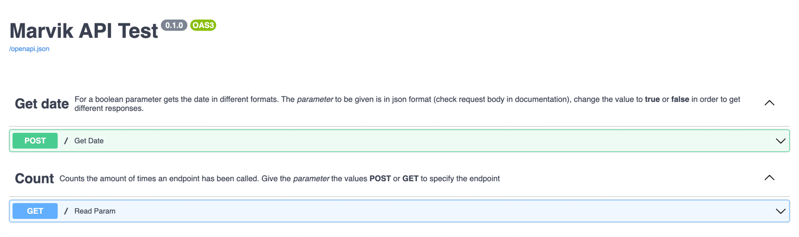
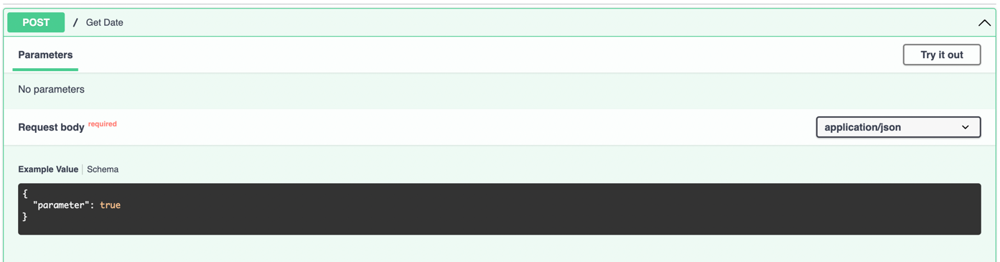
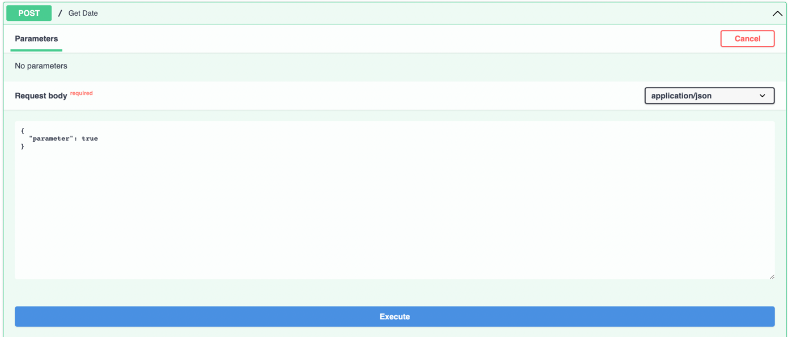
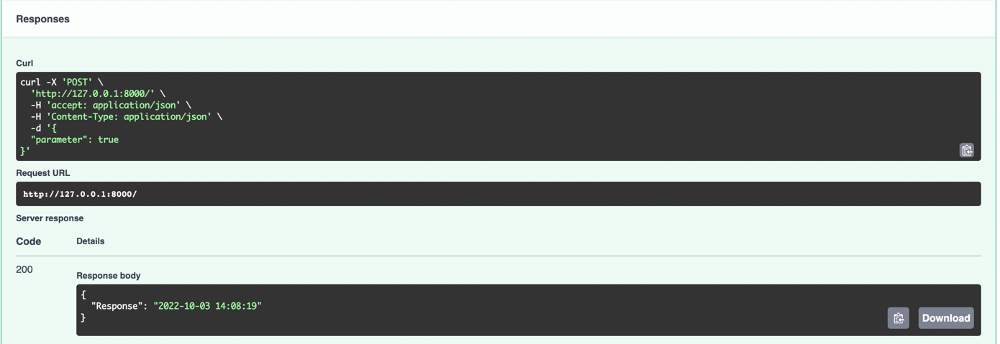
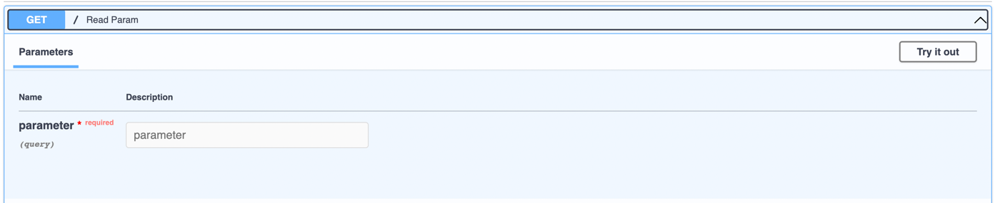
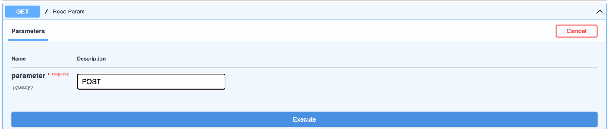
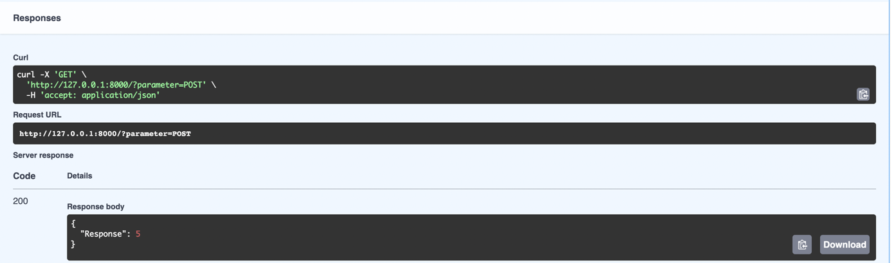

# MARVIK API TEST

This repository creates an API with two endpoints. A POST endpoint and a GET endpoint, in order to test the abilities and technical requirements to apply to Marvik.

## Description

### POST endpoint
Given a request with a boolean parameter, the endpoints response if the actual date with two different formats.
1. If the parameter given is **true** the response is in the format *aaaa-mm-dd hh:ii:ss*.
   
2. If the parameter given is **false** the response is in the format *aaaa-dd-mm*.

The body for the request is as shown in this example:

`{"parameter": true}`

Change the value to **true** or **false** in order to get different responses.

### GET endpoint
Given a parameter in this case a type of endpoint,**GET** or **POST** this endpoint response is the amount of times a specific endpoint is called.

The values of the parameter to be given are the ones listed below:
1. POST
2. GET

## Run the API
In this part of the documentation the steps to run the API are explained.

### Import libraries
Install the libraries in this repository using 
`pip install -r requirements.txt`
   
If there is a library that wasn't installed use `pip install [package_name]`

|INFO: The libraries used in this repository are: `pydantic`, `fastapi`, `datetime`, `uvicorn`
| --- |

As suggested in FastAPI documentation (https://fastapi.tiangolo.com/tutorial/) run the following commands

```
pip install fastapi`

pip install "uvicorn[standard]"
```

### Execute the API
Execute the API in local using this command in the terminal 
   ```
   uvicorn main:app --reload
   ```

This will start the server with a message like this:
```
INFO:     Will watch for changes in these directories: [directory/path]
INFO:     Uvicorn running on http://127.0.0.1:8000 (Press CTRL+C to quit)
INFO:     Started reloader process [11789] using WatchFiles
INFO:     Started server process [11791]
INFO:     Waiting for application startup.
INFO:     Application startup complete.`
```
This will start the server in the localhost URL http://127.0.0.1:8000

## Test the API

To test the API go to http://127.0.0.1:8000/docs, this will show the documentation of the API where you are able to test sending different requests.



Here you can find the 2 endpoints describe above. 

Open the first endpoint and press *Try it out*



An editor will be open where you can edit the parameter given, with the values **true** or **false** as are written in here. Then press *Execute* and this will show the response below in the section *Response body*.




Open the second endpoint and press *Try it out*



Give the value **POST** or **GET** exactly as written here to get the response. Then press *Execute* and this will show the response below in the section *Response body*.




You can also test the endpoint using **Postman** (https://www.postman.com) using the following CURL and URL
1. For the POST endpoint
```
curl -X 'POST' \
  'http://127.0.0.1:8000/' \
  -H 'accept: application/json' \
  -H 'Content-Type: application/json' \
  -d '{
  "parameter": true
}'
```
Change the value of the parameter to test the different outputs.

2. For the GET endpoint
```
curl -X 'GET' \
  'http://127.0.0.1:8000/?parameter=POST' \
  -H 'accept: application/json'
```
Change the value of the parameter to test the different outputs.

|IMPORTANT: There are different ways of creating the count endpoint. The more complete option is to create a database using SQLite that allows you to save every call to the endpoints. For the time assigned to this task a simpler solution was provided, which is create a COUNT global variable that resets every time the server is shut down. This allows the endpoint to do what is asked, but it doesn't have a "memory", only while the server is up. 
| --- |
